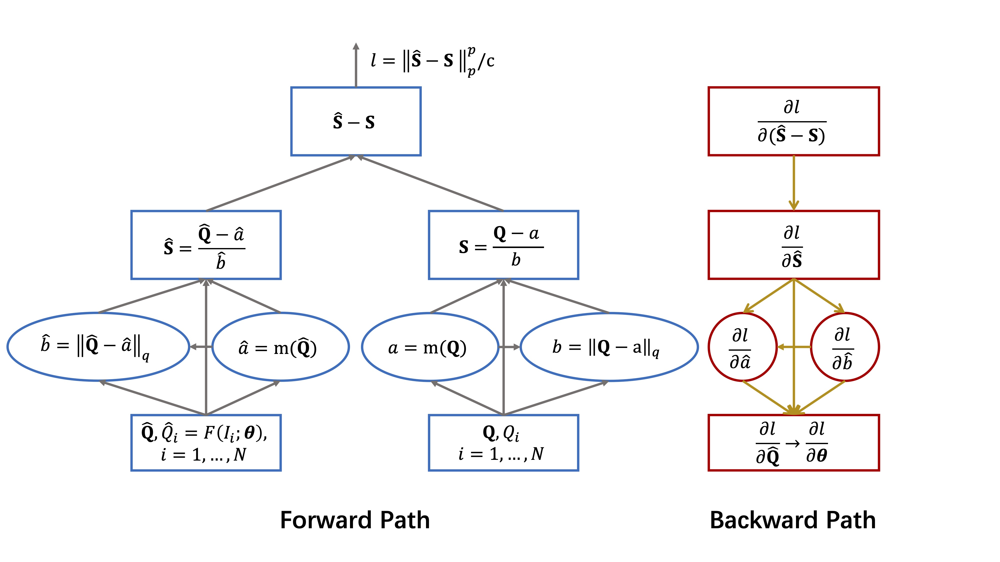
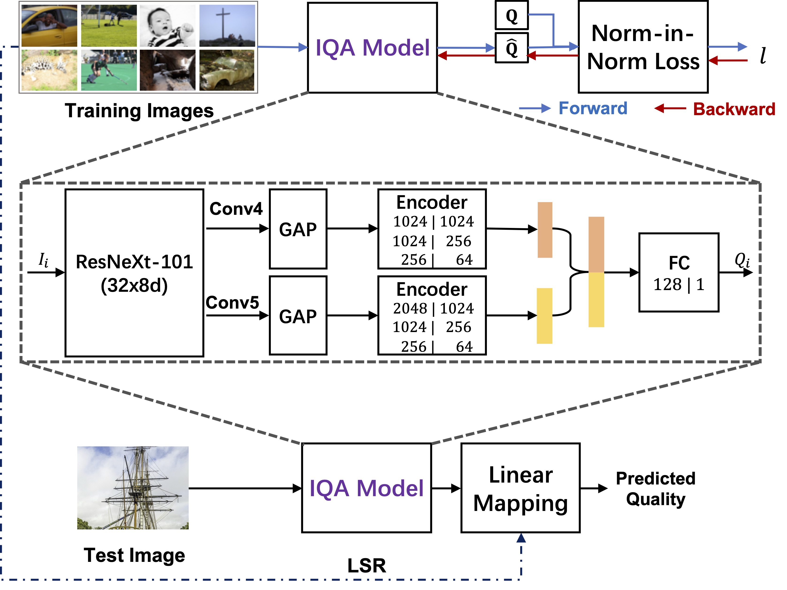

# Norm-in-Norm Loss with Faster Convergence and Better Performance for Image Quality Assessment
[](License)

## Description
LinearityIQA code for the following paper:

- Dingquan Li, Tingting Jiang, and Ming Jiang. [Norm-in-Norm Loss with Faster Convergence and Better Performance for Image Quality Assessment](). In Proceedings of the 28th ACM International Conference on Multimedia (MM ’20), October 12-16, 2020, Seattle, WA, USA. [[arxiv version]](https://arxiv.org/abs/2008.03889)




## How to?
### Install Requirements
```bash
conda create -n reproducibleresearch pip python=3.6
source activate reproducibleresearch
pip install -r requirements.txt -i https://pypi.tuna.tsinghua.edu.cn/simple > install_0.log
git clone https://github.com/NVIDIA/apex.git
cd apex
# source switch_cuda.sh 10.2 # [optional] if your cuda version for torch is 10.2
pip install -v --no-cache-dir --global-option="--cpp_ext" --global-option="--cuda_ext" ./ > install.log 
cd ..
rm -rf apex
# source deactive
```

Note: Please install apex from the [source](https://github.com/NVIDIA/apex). I installed the apex from the [source](https://github.com/NVIDIA/apex) (by following the `README.md`), and `pip freeze > requirements.txt` shows that `apex` version I used is `0.1`. Make sure that the CUDA version is consistent. If you have any installation problems, please find the details of error information in `*.log` file, e.g., if the cuda versions are not consistent between `apex` and `torch`, one can use [`switch_cuda.sh`](https://github.com/phohenecker/switch-cuda) to solve it.

### Download Datasets
Download the [KonIQ-10k](http://database.mmsp-kn.de/koniq-10k-database.html) and [CLIVE](https://live.ece.utexas.edu/research/ChallengeDB/index.html) datasets. Then, run the following `ln` commands in the root of the repo.
```bash
ln -s KonIQ-10k_path KonIQ-10k # KonIQ-10k_path is your path to the KonIQ-10k dataset
ln -s CLIVE_path CLIVE # CLIVE_path is your path to the CLIVE dataset
```

### Training on KonIQ-10k
```bash
CUDA_VISIBLE_DEVICES=0 python main.py --dataset KonIQ-10k --resize --exp_id 0 --lr 1e-4 -bs 8 -e 30 --ft_lr_ratio 0.1 --arch resnext101_32x8d --loss_type Lp --p 1 --q 2 > exp_id=0-resnext101_32x8d-p=1-q=2-664x498.log 2>&1 & # The saved checkpoint is copied and renamed as "p1q2.pth". 
CUDA_VISIBLE_DEVICES=1 python main.py --dataset KonIQ-10k --resize --exp_id 0 --lr 1e-4 -bs 8 -e 30 --ft_lr_ratio 0.1 --arch resnext101_32x8d --loss_type Lp --p 1 --q 2 --alpha 1 0.1 > exp_id=0-resnext101_32x8d-p=1-q=2-alpha=1,0.1-664x498.log 2>&1 & # The saved checkpoint is copied and renamed as "p1q2plus0.1variant.pth"
```
More options can be seen by running the help command `python main.py --help`.
#### Visualization
```bash
tensorboard --logdir=runs --port=6006 # --host your_host_ip; in the server (host:port)
ssh -p port -L 6006:localhost:6006 user@host # in your PC. See the visualization in your PC
```

You can download our [checkpoints](https://pan.baidu.com/s/1MRamimHWX8F-SOQ_QsIrvg) with a password `4z7z`. Then paste it to `checkpoints/`.

Note: We do not set `drop_last=True` where we obtained our results in the paper. However, if the `the size of training data % batch size == 1`, the last batch only contains 1 sample, one needs to set `drop_last=True` when prepare the train_loader in line 86-90 of `IQAdataset.py`. For example, if 80% images of CLIVE are considered as the training data, and the batch size is 8, then based on `929 % 8 == 1`, you will have to set `drop_last=True`. Otherwise, you will get an error in 1D batch norm layer.

### Testing
#### Testing on KonIQ-10k test set (Intra Dataset Evaluation)
```bash
CUDA_VISIBLE_DEVICES=0 python test_dataset.py --dataset KonIQ-10k --resize --arch resnext101_32x8d --trained_model_file checkpoints/p1q2.pth
CUDA_VISIBLE_DEVICES=1 python test_dataset.py --dataset KonIQ-10k --resize --arch resnext101_32x8d --trained_model_file checkpoints/p1q2plus0.1variant.pth
```
#### Testing on CLIVE (Cross Dataset Evaluation)
```bash
CUDA_VISIBLE_DEVICES=0 python test_dataset.py --dataset CLIVE --resize --arch resnext101_32x8d --trained_model_file checkpoints/p1q2.pth
CUDA_VISIBLE_DEVICES=1 python test_dataset.py --dataset CLIVE --resize --arch resnext101_32x8d --trained_model_file checkpoints/p1q2plus0.1variant.pth
```
#### Test Demo
```bash
CUDA_VISIBLE_DEVICES=0 python test_demo.py --img data/1000.JPG --resize --arch resnext101_32x8d --trained_model_file checkpoints/p1q2.pth
# > The image quality score is 10.430044178601875
CUDA_VISIBLE_DEVICES=1 python test_demo.py --img data/1000.JPG --resize --arch resnext101_32x8d --trained_model_file checkpoints/p1q2plus0.1variant.pth
# > The image quality score is 16.726127839961094
```

### Remark
If one wants to use the "Norm-in=Norm" loss in his project, he can refer to the `norm_loss_with_normalization` in `IQAloss.py`.

If one wants to use the model in his project, he can refer to the `IQAmodel.py`.

### Contact
Dingquan Li, dingquanli AT pku DOT edu DOT cn.
